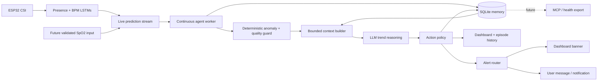

# PulseFi Agentic Health Monitor — One-Page Design

## Requirement

PulseFi must continuously monitor **real LSTM heartbeat predictions** in a
background worker and turn them into a useful agentic health-monitoring
experience. The system must detect abnormal changes over time, predict
short-term trends, provide feedback and suggestions, create visible alerts,
maintain working/episodic/semantic/procedural/parametric memory, learn a
personal baseline across sessions, persist every reading and decision, and
surface its output in the PulseFi dashboard. The LSTM is the perception and
parametric-memory layer; the agent must interpret, remember, predict, and act.
MCP export and Google Health remain future integration points. The product is a
wellness research prototype, not a diagnostic medical device.

## Wiring the requirements




| Requirement           | Concrete wiring                                                                                                                                                                           |
| --------------------- | ----------------------------------------------------------------------------------------------------------------------------------------------------------------------------------------- |
| Continuous monitoring | `worker.py` tails `live_predictions.csv`, processes complete rows, persists its cursor, and survives restarts.                                                                            |
| Safe ingestion        | The worker enforces one owner per database, validates the full CSV schema, and persists redacted rejection events before advancing malformed rows.                                       |
| Detect abnormality    | A deterministic guard evaluates presence confidence, missing BPM, sudden delta, sustained high/low rate, sensor disagreement, and recovery. The LLM cannot suppress a guard-raised alert. |
| Reason over time      | The context builder supplies the current reading, rolling statistics, baseline deviation, active episode, recent episodes, and semantic profile—not just one BPM value.                   |
| Predict trends        | The LLM returns direction, short-horizon outlook, confidence, evidence, and uncertainty using validated structured JSON.                                                                  |
| Provide feedback      | The action policy converts the decision into a concise explanation and one safe next action.                                                                                              |
| Act visibly           | Every decision updates the Streamlit dashboard; `watch` and `urgent` states create alert cards, while recovery closes the episode.                                                        |
| Remember              | SQLite stores working readings, episodic events, semantic baseline/profile, procedural policy, LSTM metadata, actions, and traces.                                                        |
| Learn across sessions | Stable, high-confidence resting segments update a rolling personal baseline; noisy, absent, exercise-tagged, and alerting segments do not.                                                |
| Trace                 | Every tick records input, recalled memory, guard result, model output, action, latency, token usage, and eventual episode outcome.                                                       |
| Integrate later       | An export interface reads approved records from SQLite; MCP and Google Health adapters are separate future modules.                                                                       |
| Deliver honestly      | A configured JSONL transport performs real at-least-once delivery with bounded persisted retries; without it, outbox events remain visibly pending.                                      |


## Runtime agent loop

1. **Observe:** parse a real LSTM row and reject incomplete or duplicate input.
2. **Validate:** assess presence confidence, signal quality, sensor validity, and
  plausible BPM range.
3. **Detect:** compute rolling mean, slope, variance, baseline deviation, sudden
  change, sustained condition, and recovery counters.
4. **Recall:** load the active episode, recent similar episodes, personal
  baseline, latest semantic profile, and procedural policy.
5. **Reason:** call the configured LLM with bounded context and require:
  `state`, `trend`, `forecast`, `evidence`, `feedback`, `suggestion`,
   `confidence`, and `memory_update`.
6. **Policy:** merge deterministic guard severity with LLM interpretation. The
  final state is the safer/higher-severity result.
7. **Act:** write the decision, update/open/close an episode, publish dashboard
  state, and create an alert when severity changes.
8. **Verify:** confirm the database transaction and UI event succeeded before
  advancing the stream cursor.
9. **Remember:** update semantic memory and baseline only when eligibility
  rules pass; then continue to the next row.


## State and action model


| State        | Entry                                                     | Action                                                                 | Exit                                                   |
| ------------ | --------------------------------------------------------- | ---------------------------------------------------------------------- | ------------------------------------------------------ |
| `no_person`  | Presence below threshold                                  | Suppress BPM judgment; show waiting state                              | Sustained reliable presence                            |
| `normal`     | Rate near personal baseline                               | Show current trend and continue monitoring                             | Guard or agent identifies sustained deviation          |
| `watch`      | Moderate/sudden deviation or uncertain pattern            | Open episode, explain evidence, suggest rest/recheck                   | Recovery window or escalation                          |
| `urgent`     | Severe sustained deviation or concerning repeated pattern | Prominent alert; advise validated recheck and symptom-aware escalation | Confirmed recovery                                     |
| `recovering` | Rate returns toward baseline after alert                  | Keep episode visible and verify stability                              | Stable window closes episode, or rebound reopens alert |


Hysteresis is required: one spike can open a watch, but normal readings must
remain stable for a configured recovery window before closing it. This prevents
both alert flicker and the previous behavior where every post-spike reading
remained indefinitely concerning.

## Abnormal readings and user alerts

Every confirmed transition from `normal` to `watch` or `urgent` must create a
user-visible alert. Persisting abnormality updates the existing alert rather
than sending another message every second. Escalation sends a new message
immediately. Confirmed recovery sends one resolution message and closes the
episode.

The alert router supports:

1. A required dashboard banner sourced from committed SQLite state.
2. A required in-app message on episode open, escalation, and recovery.
3. Optional desktop, push, SMS, or email adapters with acknowledgement,
   cooldown, delivery status, and retry.
4. An audit record containing trigger, evidence, severity, message, delivery
   attempts, acknowledgement, and resolution.

A transport failure must never remove the dashboard alert. Every message states
the measurement, why it was flagged, confirmation count, uncertainty, and one
safe next step. Messages must not diagnose a condition.

### Heart-rate alert policy

The American Heart Association describes a normal resting adult heart rate as
60–100 BPM. A resting rate above 100 BPM may be tachycardia, and a rate below
60 BPM may be bradycardia. Sleep, athletic conditioning, medication, exercise,
temperature, emotion, and health status can change the interpretation.

PulseFi therefore uses those values as contextual alert inputs:

- A sustained resting rate outside 60–100 BPM creates a `watch` message.
- A large sudden change or severe deviation from the personal baseline alerts
  even before a population threshold is sustained.
- A sudden very high or very low rate plus reported chest pain, shortness of
  breath, dizziness, or fainting creates `urgent` symptom-aware guidance.
- Exercise, sleeping, athlete, and medication context changes the explanation
  and confirmation policy; it does not silently discard the reading.

Sources:

- [American Heart Association — All About Heart Rate](https://www.heart.org/en/health-topics/high-blood-pressure/the-facts-about-high-blood-pressure/all-about-heart-rate-pulse)
- [American Heart Association — Tachycardia](https://www.heart.org/en/health-topics/arrhythmia/about-arrhythmia/tachycardia--fast-heart-rate)
- [American Heart Association — Bradycardia](https://www.heart.org/en/health-topics/arrhythmia/about-arrhythmia/bradycardia--slow-heart-rate)

### Future pulse-oximeter alert policy

The current receiver uses the MAX30105 only to produce reference BPM. Its
firmware does **not** calculate oxygen saturation, so the current project must
not display, infer, or alert on SpO₂. Oxygen alerts activate only after a
validated measurement path provides:

```text
spo2_percent, spo2_valid, spo2_signal_quality, measurement_source
```

For a valid future SpO₂ measurement:

- **95–100%:** normal for most healthy people; no oxygen alert.
- **93–94%:** `watch`; ask the user to sit still, warm the hand, verify sensor
  placement, wait for a stable value, and repeat. Alert when confirmed.
- **92% or lower:** send a prominent message advising contact with a
  health-care provider.
- **88% or lower:** send an `urgent` message advising immediate medical
  attention.
- **Serious or worsening symptoms:** show urgent symptom-aware guidance
  regardless of a reassuring device number.

MedlinePlus notes that pulse-oximeter values may be 2–4 percentage points above
or below actual saturation. The FDA identifies poor circulation, skin
pigmentation, skin thickness/temperature, tobacco use, and fingernail polish as
accuracy factors. Oxygen severity must therefore consider signal quality,
repeated readings, altitude, clinician-provided targets, symptoms, and known
heart/lung conditions. The UI displays the reading and quality/context, not
only a green/red label.

Sources:

- [MedlinePlus — Pulse Oximetry](https://medlineplus.gov/lab-tests/pulse-oximetry/)
- [FDA — Pulse Oximeter Basics](https://www.fda.gov/consumers/consumer-updates/pulse-oximeter-basics)

### Example messages

**Heart-rate watch**

> PulseFi measured 128 BPM at rest for two consecutive readings, above your
> recent baseline of 76 BPM. Sit down and recheck with a validated device.

**Oxygen watch — future validated SpO₂ only**

> Oxygen saturation is 93% on two stable readings. Check sensor placement,
> warm your hand, remain still, and repeat the measurement.

**Oxygen urgent — future validated SpO₂ only**

> Oxygen saturation is 88% or lower on a valid reading. Seek immediate medical
> attention. If you have trouble breathing, chest pain, confusion, or bluish
> lips or face, use emergency services now.

## Memory and persistence

- **Working:** recent raw predictions and derived rolling features.
- **Episodic:** start, peak, duration, evidence, actions, recovery, and outcome
for each abnormal period.
- **Semantic:** personal resting baseline, variability, typical recovery, and
recurring patterns derived only from eligible sessions.
- **Procedural:** validation, detection, escalation, recovery, and baseline
update rules.
- **Parametric:** versioned LSTM model metadata and metrics representing learned
CSI patterns.
- **Trace:** complete agent tick lineage from observation through final action.

Core tables: `observations`, `features`, `episodes`, `semantic_profile`,
`decisions`, `actions`, `alert_events`, `delivery_attempts`, `traces`,
`model_registry`, and `stream_cursor`.

## Dashboard deliverable

The existing Streamlit UI gains: live agent state, BPM versus personal
baseline, future validated SpO₂, trend/forecast, evidence, current suggestion,
active-alert banner, acknowledgement control, notification delivery state,
episode timeline, memory/profile panel, and agent/API health. The dashboard
reads committed SQLite state; terminal output is diagnostic only.

## Acceptance criteria

Implementation is complete when the generated or live prediction stream drives
the same production worker; the guard and LLM states are persisted separately;
the final policy cannot downgrade guard severity; episode open, escalation,
recovery, and resolution create durable messages; the dashboard reads committed
SQLite state and supports acknowledgement; memory survives restart; API
failures and unscheduled LLM ticks are visible; and future integrations consume
versioned outbox events without being represented as active connections.
Missing Groq credentials must leave deterministic monitoring active and visibly
mark reasoning as disabled.

`AGENTIC_EVALUATION_TEST_PLAN.md` is retained as a future plan. Its execution is
outside the current scope.