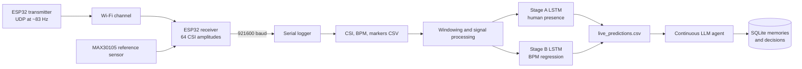

# PulseFi

PulseFi is a contactless heart-rate monitoring prototype that estimates human
presence and beats per minute from Wi-Fi Channel State Information (CSI). Two
ESP32 boards generate and capture Wi-Fi traffic, an optical MAX30105 sensor
provides reference BPM labels during data collection, two LSTM models perform
presence classification and heart-rate regression, and a continuous LLM worker
analyzes live predictions with persistent memory.

> PulseFi is a research prototype, not a medical device. Its predictions and
> LLM feedback must not be used for diagnosis or emergency decision-making.

## Agentic AI features

PulseFi extends the LSTM inference pipeline with a persistent background AI
agent. This is not a rules engine or text template: every new inference row is
sent to a configured OpenAI-compatible model for structured analysis.

- **Continuous background worker:** tails `runtime/live_predictions.csv` and
  analyzes every new LSTM observation.
- **Real LLM calls:** sends current BPM, presence confidence, recent history,
  prior episodes, learned facts, and the agent procedure to the configured
  chat-completions endpoint.
- **Structured decisions:** requires validated JSON containing `status`,
  `trend`, `prediction`, `feedback`, `suggestion`, `confidence`, and
  `memory_summary`.
- **Working memory:** supplies the 20 most recent LSTM observations as bounded
  short-term context.
- **Episodic memory:** opens, updates, and closes persistent `watch` or `urgent`
  heart-rate episodes.
- **Semantic memory:** carries the latest model-generated summary into future
  analysis.
- **Procedural memory:** stores the fixed ingest, recall, analyze, validate,
  and persist workflow.
- **Parametric memory:** represents the upstream LSTM weights as learned memory
  of Wi-Fi CSI heartbeat patterns.
- **Decision trace:** records model identity, confidence, prediction, feedback,
  and suggestion for each processed observation.
- **Evaluation tracing:** records run IDs, context size, memory counts, API
  latency, status, confidence, outcomes, and errors for every model call.
- **Real-API dry run:** generates labeled synthetic 80–100 BPM readings with
  randomized 150 BPM spikes and measures how the configured agent responds.
- **Restart-safe processing:** saves its CSV byte offset and resumes without
  reprocessing committed rows.
- **Failure recovery:** retains a row and retries when an API request fails;
  the cursor advances only after the decision is stored successfully.
- **Provider configuration:** supports OpenAI-compatible endpoints through
  `OPENAI_API_KEY`, `PULSEFI_AGENT_MODEL`, and `PULSEFI_AGENT_BASE_URL`.
- **Safety constraints:** instructs the model not to diagnose conditions and
  to produce cautious, uncertainty-aware wellness feedback.

The agent writes its complete state to `runtime/pulsefi_agent.db`, making the
reasoning history and all memory categories available across process restarts.

## Current results

The committed phase-1 metrics were produced from 413 processed windows with
session-level train, validation, and test splits:

| Metric | Validation | Test |
| --- | ---: | ---: |
| Stable/non-human F1 | 0.600 | 0.815 |
| Human F1 | 0.895 | 0.865 |
| Macro F1 | 0.747 | **0.840** |
| BPM mean absolute error | **13.19 BPM** | **14.36 BPM** |

The recorded `0.90` validation macro-F1 target was not met. Model weights and
raw recordings are not committed to this repository; `models/phase1/metrics.json`
contains the saved evaluation report.

## System architecture



## Hardware

### Transmitter

`firmware/transmitter/Transmitter.ino`

- Runs an ESP32 as the `txpulse` Wi-Fi access point on channel 1.
- Sends unicast UDP packets to `192.168.4.2:4210`.
- Uses a 12 ms period, producing approximately 83 packets per second.
- Disables Wi-Fi power saving to stabilize packet timing.

### Receiver

`firmware/receiver/RecieverESP32.ino`

- Joins the transmitter network as a station.
- Enables the ESP32 CSI callback.
- Converts I/Q values into amplitudes for 64 subcarriers.
- Reads the MAX30105 optical sensor as the training/reference BPM source.
- Emits CSI and BPM records over serial at 921600 baud.
- Uses separate FreeRTOS tasks for CSI printing and heart-rate sampling.

Receiver serial records:

```text
CSI_PKT,<timestamp_us>,<sequence>,<rssi>,<csi_length>,<64 amplitudes>
BPM,<timestamp_us>,<bpm>,<valid>,<sensor_age_ms>
STATUS,<connection and packet-rate fields>
```

## Data collection

`pipeline/logger.py` records one session into:

```text
data/<session>/
├── csi_packets.csv
├── bpm_stream.csv
├── markers.csv
└── serial_raw.log
```

Two recording classes are supported:

- **Human:** a person sits between the ESP32 boards while the MAX30105 provides
  reference BPM. `human_start` and `human_end` markers define the interval.
- **Stable/non-human:** the room is empty and the markers file has no events.

The logger validates the expected 64-subcarrier CSI schema and keeps CSI and
sensor timestamps in the receiver ESP32 clock domain.

## Signal processing

`pipeline/build_training_csv.py` transforms raw sessions into overlapping
training windows.

Each window contains exactly 1600 CSI packets, approximately 20 seconds at the
target 80 Hz packet rate. The default orchestrated stride is 300 packets.

Processing is applied independently to each subcarrier:

1. Remove the DC component.
2. Apply a third-order Butterworth bandpass from 0.8 to 2.17 Hz.
3. Apply Savitzky–Golay smoothing.
4. Normalize by the global standard deviation of the window.
5. Compute a 64-element periodicity vector from autocorrelation peaks in the
   expected heart-rate lag range.

Human windows receive an overlap-weighted BPM label from valid MAX30105
segments. Stale labels are rejected to reduce CSI/BPM synchronization errors.

## Machine-learning models

### Stage A: presence classifier

`pipeline/train_two_stage.py`

- Input 1: processed CSI window with shape `1600 × 64`.
- Input 2: 64-element periodicity vector.
- Architecture: stacked LSTMs, dropout, periodicity projection, concatenation,
  and sigmoid classification.
- Output: probability of `human` versus `stable/non-human`.
- Uses class weights to reduce class-imbalance effects.

### Stage B: heart-rate regressor

- Trained only on valid human windows.
- Input: processed CSI window with shape `1600 × 64`.
- Architecture: stacked LSTMs followed by dense BPM regression.
- Output: estimated BPM.

### Leakage prevention

Training, validation, and test partitions are split by complete recording
session. Overlapping windows from one session therefore cannot appear in
multiple partitions. Synthetic sessions are restricted to training.

### Alternative short-window model

`pipeline/train_nickbild.py` adapts the `csi_hr` architecture to 100 packets and
64 subcarriers. `pipeline/infer_nickbild.py` performs serial inference with
that model.

## Data augmentation

- `pipeline/augment_time_stretch.py` resamples real human CSI windows to create
  target heart-rate ranges while retaining waveform and subcarrier structure.
- `pipeline/augment_stable_synth.py` creates synthetic stable/non-human windows.
- `pipeline/merge_training_csv.py` combines session CSVs into
  `data/all_training_main.csv`.

## Presence features

`pipeline/presence_5s.py` provides a lightweight five-second presence path
using amplitude variance, subcarrier cross-correlation, respiratory-band power,
peak-to-high-band ratios, and bandpass standard deviation.

`pipeline/sweep_presence_thresholds.py` evaluates thresholds for these
features across labeled sessions.

## Live inference

`pipeline/run_live_inference.py`:

1. Reads CSI and reference BPM records from the receiver serial port.
2. Maintains rolling CSI buffers.
3. Applies the same filtering used during training.
4. Runs the Stage A classifier.
5. Runs Stage B BPM regression for detected-human windows.
6. Smooths predictions.
7. Appends results to `runtime/live_predictions.csv`.

Output schema:

```text
rx_ts_us
detected_human
ml_prob_human_30s
ml_prob_human_30s_smooth
pred_bpm_ml_display
sensor_bpm
sensor_bpm_valid
```

## Agentic heartbeat analysis

The `agentic/` package contains the real continuous LLM worker. It does not
replace the LSTM. The LSTM remains the perception layer; the agent consumes its
structured presence and BPM outputs.

### Component map

| File | Responsibility |
| --- | --- |
| `agentic/worker.py` | Loads configuration, tails the live CSV, retries failures, and prints decisions |
| `agentic/dry_run.py` | Sends synthetic BPM inputs through the real API and scores reactions |
| `agentic/models.py` | Converts live-inference CSV fields into a typed `Reading` |
| `agentic/loop.py` | Builds the memory context and executes one model-backed agent tick |
| `agentic/llm.py` | Calls the OpenAI-compatible API and validates structured output |
| `agentic/db.py` | Owns the SQLite schema, transactions, episodes, memories, and cursor |
| `agentic/__main__.py` | Exposes the `python -m agentic worker` command |

There is no local fallback that fabricates agent output. Missing credentials
stop startup, and failed API requests leave their input row pending for retry.

### Input contract

The worker tails the CSV produced by `pipeline/run_live_inference.py`. Each row
is normalized into:

```json
{
  "ts_us": 1700000000000000,
  "human": true,
  "presence": 0.91,
  "bpm": 78.4,
  "sensor_bpm": 80.0,
  "sensor_valid": true,
  "source": "lstm_live"
}
```

Field mapping:

| Agent field | Live-inference column |
| --- | --- |
| `ts_us` | `rx_ts_us` |
| `human` | `detected_human` |
| `presence` | `ml_prob_human_30s_smooth`, then raw probability as fallback |
| `bpm` | `pred_bpm_ml_display` |
| `sensor_bpm` | `sensor_bpm` |
| `sensor_valid` | `sensor_bpm_valid` |

Zero or negative BPM values become `null`, because live inference uses zero when
no person is detected. The parser also accepts the older dashboard column names
`class_pred`, `class_prob_human`, and `pred_bpm`.

### Continuous worker lifecycle

`CsvTail` stores a byte offset for the live CSV rather than repeatedly loading
the entire file:

1. Check whether `runtime/live_predictions.csv` exists.
2. Read and parse its header.
3. Seek to the last committed byte offset.
4. Read one complete line; partial lines are left untouched.
5. Convert the row into a typed LSTM observation.
6. Skip rows already committed under the same timestamp and source.
7. Run one model-backed agent tick.
8. Commit the observation, model decision, episodes, and semantic memory.
9. Advance the CSV cursor only after that commit succeeds.
10. Continue polling until interrupted with `Ctrl+C`.

If live inference truncates or recreates the CSV, the worker detects that the
file is shorter than the stored offset and starts from the new header.

The default poll interval is 0.5 seconds. An API error applies a bounded retry
delay and does not advance the cursor, so the same inference row is presented
to the model again.

### One agent tick

For each new row in `runtime/live_predictions.csv`, the worker:

1. Checks observation identity against persisted memory.
2. Builds a bounded context packet.
3. Calls the configured OpenAI-compatible model.
4. Parses the returned JSON.
5. Validates status, confidence, and required fields.
6. Stores the complete tick in one SQLite transaction.
7. Returns the decision to the worker for terminal output.

The context packet contains:

- The current LSTM observation.
- The 20 most recent committed observations.
- The five most recent episodes.
- All current semantic facts.
- The fixed procedural playbook.
- Metadata explaining that the upstream LSTM is parametric memory.
- A warning that CSI-based BPM and presence estimates may be wrong.
- A requirement that output remain non-diagnostic.

This keeps prompt growth bounded as the database grows.

### Real model call

`OpenAICompatibleClient` sends an HTTPS `POST` request to:

```text
${PULSEFI_AGENT_BASE_URL}/chat/completions
```

The request includes:

- Bearer authentication from `OPENAI_API_KEY`.
- The configured `PULSEFI_AGENT_MODEL`.
- Temperature `0.2` for more stable output.
- JSON response mode.
- A system prompt defining behavior and safety limits.
- The serialized context packet as the user message.

The default endpoint is `https://api.openai.com/v1`, and the default model is
`gpt-4o-mini`. Because the API is OpenAI-compatible, the endpoint and model can
be replaced without changing the loop.

### Structured decision contract

The model must return exactly one JSON object:

```json
{
  "status": "normal",
  "trend": "stable near recent baseline",
  "prediction": "The next readings may remain near this range, but this is uncertain.",
  "feedback": "The estimated rate is stable in the recent context.",
  "suggestion": "Continue monitoring in the same posture.",
  "confidence": 0.78,
  "memory_summary": "Rate remained stable during this observation."
}
```

Validation rejects:

- Missing fields.
- A status outside the supported status set.
- Confidence outside `0.0–1.0`.
- Non-JSON responses.
- Unexpected API response shapes.

Text fields are length-limited before persistence: trend to 80 characters and
prediction, feedback, suggestion, and memory summary to 500 characters each.

### Agent statuses

- `no_person`: the perception layer does not currently detect a person.
- `normal`: no concerning pattern is identified in the supplied context.
- `watch`: a pattern should continue to be monitored.
- `urgent`: the model recommends prompt attention and independent verification.

The system prompt explicitly prevents diagnosis and requires uncertain,
cautious wellness feedback. The model is instructed to recommend checking with
a validated device and seeking professional help when symptoms or immediate
danger are present.

The status is selected by the LLM from the supplied context. There is currently
no separate deterministic medical threshold engine, and the status must not be
treated as a clinical classification.

### Memory model

The default database is `runtime/pulsefi_agent.db`.

| Memory | SQLite representation | Purpose |
| --- | --- | --- |
| Working | `observations` | Recent LSTM readings supplied to each agent tick |
| Episodic | `episodes` | Open and closed `watch`/`urgent` periods |
| Semantic | `semantic_memory` | Model-generated summary carried into future ticks |
| Procedural | `procedural_memory` | Fixed steps executed by the agent loop |
| Parametric | `model_memory` | Records the upstream LSTM as learned signal memory |
| Decision trace | `decisions` | Model, confidence, prediction, feedback, and suggestion |
| Evaluation trace | `traces` | Run ID, context size, latency, outcome, status, confidence, and errors |
| Runtime cursor | `stream_cursor` | Restart-safe position in the live CSV |

#### Working memory

The `observations` table stores normalized LSTM readings. The latest 20 rows are
loaded into each prompt. A `(ts_us, source)` uniqueness constraint prevents the
same live observation from being committed twice.

#### Episodic memory

When the model returns `watch` or `urgent`, the database opens an episode if
none exists. Additional concerning decisions update that episode's status and
summary. A later `normal` or `no_person` result closes it. The five latest
episodes are recalled on future ticks.

#### Semantic memory

Every accepted decision includes a one-sentence `memory_summary`. The latest
summary is stored as `latest_agent_memory` and supplied to later model calls.
This gives the model cross-tick context without replaying the full decision
history.

#### Procedural memory

The database persists the agent's fixed procedure:

1. Ingest a real inference row.
2. Load bounded memories.
3. Call the configured language model.
4. Validate structured output.
5. Persist the decision and memory updates.

This procedure is explicit context, not model-generated behavior.

#### Parametric memory

The trained LSTM weights are treated conceptually as parametric memory: they
encode CSI patterns learned during training. The agent database records this
relationship as metadata. The agent worker does not load or execute the LSTM
weights itself; it consumes the upstream prediction CSV.

#### Decision trace

The `decisions` table stores:

- Linked observation ID.
- Status and trend.
- Prediction, feedback, and suggestion.
- Model confidence.
- Memory summary.
- Exact configured model name.
- Decision creation timestamp.

This makes every accepted model response auditable after the worker exits.

### Transaction and recovery behavior

The observation, decision, episode change, and semantic-memory update are
written inside one SQLite transaction. A failure before transaction completion
does not leave a partial agent tick.

The stream cursor is advanced afterward. If the process stops between database
commit and cursor advancement, the uniqueness check recognizes the observation
on restart and safely advances past it without issuing another model call.

### Agent configuration

Copy `.env.example` to `.env` and use a valid key:

```bash
cp .env.example .env
```

```dotenv
OPENAI_API_KEY=replace-with-your-key
PULSEFI_AGENT_MODEL=gpt-4o-mini
PULSEFI_AGENT_BASE_URL=https://api.openai.com/v1
```

`.env` and `runtime/` are ignored by Git. The worker also accepts these values
from the shell, with shell variables taking precedence.

Run the worker:

```bash
python -m agentic worker
```

Custom paths:

```bash
python -m agentic worker \
  --csv runtime/live_predictions.csv \
  --db runtime/pulsefi_agent.db \
  --poll-seconds 0.5
```

The worker refuses to start when `OPENAI_API_KEY` is missing. The repository
does not include an MCP server or a Google Health integration.

### Terminal output

Every accepted decision prints:

```text
bpm=78.4 status=normal confidence=0.78
  prediction: ...
  feedback: ...
  suggestion: ...
```

The terminal is only a live view. SQLite remains the source of truth for
persisted agent state.

### Real-API dry run and evaluation tracing

The dry run tests how the actual configured LLM reacts to a controlled input
stream. The heart-rate values are synthetic inputs only; all statuses,
predictions, feedback, suggestions, confidence values, and memory changes come
from the real API-backed agent.

Run:

```bash
python -m agentic dry-run \
  --seconds 8 \
  --spikes 2 \
  --seed 42
```

The generator creates one timestamped observation per simulated second:

- Normal values are randomly sampled from 80–100 BPM.
- Spike positions are randomly selected after the first reading.
- Spike values are fixed at 150 BPM.
- Presence remains high.
- The reference sensor is marked unavailable.
- Every input is labeled with source `synthetic_dry_run`.

The dry run calls the same `HeartbeatAgent`, model client, validation, memory,
episode, and persistence code used by the continuous worker. It does not use a
mock client or hardcoded agent response.

Each model call writes a row to the `traces` table:

| Trace field | Meaning |
| --- | --- |
| `run_id` | Groups all ticks from one evaluation |
| `ts_us` | Simulated observation timestamp |
| `source` and `bpm` | Input identity and BPM |
| `model` | Configured model used for the call |
| `context_bytes` | Serialized prompt-context size |
| `working_memory_count` | Number of recent observations recalled |
| `episode_count` | Number of episodes recalled |
| `latency_ms` | End-to-end model-call latency |
| `outcome` | `success` or `error` |
| `status` and `confidence` | Validated agent reaction |
| `error` | Exception details for failed calls |

At completion, traces are exported to
`runtime/pulsefi_dry_run_trace.jsonl`. The evaluator treats 150 BPM inputs as
positive spike cases and `watch`/`urgent` statuses as positive agent reactions.
It reports:

- True positives, false positives, false negatives, and true negatives.
- Spike-reaction precision.
- Spike-reaction recall.
- Overall status accuracy for the generated stream.
- Mean and maximum API latency.

Custom evaluation:

```bash
python -m agentic dry-run \
  --seconds 30 \
  --spikes 5 \
  --seed 7 \
  --db runtime/custom_eval.db \
  --trace-jsonl runtime/custom_eval_trace.jsonl
```

These metrics evaluate agent reactions to the synthetic scenario; they are not
medical-accuracy metrics and must not be combined with the LSTM F1 or BPM MAE.

### Current agent limitations

- One API call is made per new inference row, which can create material API
  cost when the CSV is written frequently.
- No batching, rate limiter, or token-usage accounting is implemented.
- Semantic memory currently retains only the latest summary rather than a
  searchable long-term knowledge store.
- Only one episode can be open at a time.
- Episode transitions depend on LLM statuses rather than deterministic bounds.
- SQLite data is local and is not encrypted by the application.
- The worker prints results to the terminal; it does not yet expose a dedicated
  dashboard, notification channel, MCP server, or health-platform connector.
- A configured API and network connection are required for every new decision.
- Agent feedback has not been clinically validated.

## Dashboards

- `pipeline/dashboard.py` combines serial input, inference, and Streamlit
  visualization.
- `ui/ui_dashboard.py` visualizes an existing predictions CSV with Plotly.

The dashboard displays presence confidence, predicted BPM, reference sensor
BPM, rolling trends, and CSI views.

## Installation

### Requirements

- Python 3.11
- Two ESP32 boards
- MAX30105 optical heart-rate sensor
- Arduino ESP32 Wi-Fi/CSI support
- SparkFun MAX3010x sensor library

Install the Python dependencies:

```bash
python3.11 -m venv .venv
source .venv/bin/activate
pip install numpy scipy tensorflow pyserial pandas plotly streamlit
```

`main.py` currently points to
`/Library/Frameworks/Python.framework/Versions/3.11/bin/python3.11`. Change
`PYTHON_311` if Python is installed elsewhere.

## Quick start

### 1. Flash the boards

Flash:

- `firmware/transmitter/Transmitter.ino` to the transmitter.
- `firmware/receiver/RecieverESP32.ino` to the receiver.

Connect the receiver to the computer over USB.

### 2. Open the orchestrator

```bash
python3.11 main.py
```

The menu supports:

1. Capture a raw session.
2. Validate raw data.
3. Build one training CSV.
4. Build all training CSVs.
5. Generate time-stretch augmentation.
6. Merge training data.
7. Train the two-stage models.
8. Test the models.
9. Train the short-window model.
10. Run live inference.
11. Run the dashboard.
12. Run the complete offline pipeline.
13. Run the LLM heartbeat worker.

### 3. Train

Use menu steps 3–7, or run the scripts directly. Expected two-stage artifacts:

```text
models/phase1/
├── stage_a_classifier.keras
├── stage_b_regressor.keras
└── metrics.json
```

The `.keras` artifacts are not currently included in the repository and must
be trained or supplied before live inference.

### 4. Start live inference

```bash
python3.11 pipeline/run_live_inference.py \
  --port /dev/cu.usbserial-0001 \
  --classifier-model models/phase1/stage_a_classifier.keras \
  --regressor-model models/phase1/stage_b_regressor.keras \
  --out-csv runtime/live_predictions.csv
```

### 5. Start the agent

In another terminal:

```bash
python3.11 -m agentic worker
```

Live inference produces the CSV; the agent tails it continuously and persists
its analysis to SQLite.

## Repository structure

```text
PulseFi/
├── agentic/                 # LLM client, loop, worker, and SQLite memories
├── firmware/
│   ├── transmitter/        # ESP32 access point and UDP packet source
│   └── receiver/           # CSI capture and MAX30105 reference BPM
├── models/phase1/          # Saved metrics; model weights created by training
├── pipeline/               # Collection, processing, training, inference, UI
├── ui/                     # CSV-based Streamlit dashboard
├── main.py                 # Interactive project orchestrator
└── .env.example            # Agent configuration template
```

## Limitations

- The committed test set contains only 32 windows.
- The saved test BPM error is 14.36 BPM, so accuracy is not clinical-grade.
- Stable/non-human validation F1 is lower than human F1.
- Performance depends strongly on room layout, ESP32 placement, subject
  movement, packet rate, and CSI quality.
- The bandpass emphasizes approximately 48–130 BPM.
- The optical sensor is a reference label source, not part of contactless
  deployment.
- LLM output is interpretive wellness feedback, not medical judgment.
- API calls add latency, cost, and network dependency.
- The agent worker requires the live prediction CSV; it does not read raw CSI.

## Security

- Never commit `.env` or API keys.
- Rotate any key that has been pasted into chat, logs, or source files.
- Keep `runtime/pulsefi_agent.db` private because it contains heart-rate
  history and generated interpretations.
- Treat exported health data as sensitive personal information.

## License

No license file is currently included. Add one before redistributing or
incorporating the project into another product.
