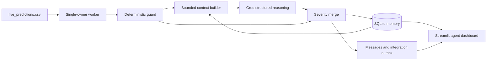

# PulseFi

PulseFi is a hardware-first heartbeat and human-presence detection system that estimates vitals from Wi-Fi Channel State Information (CSI).

## What It Does

- Streams CSI amplitude features from an ESP32 receiver over serial.
- Uses a MAX30105 heart-rate sensor as BPM ground truth during data collection.
- Runs a two-stage ML pipeline:
  - Stage A: human presence classifier
  - Stage B: BPM regressor
- Supports live inference and runtime logging from incoming CSI packets.

## Repository Structure

- `firmware/transmitter/Transmitter.ino`: ESP32 transmitter firmware.
- `firmware/receiver/RecieverESP32.ino`: ESP32 receiver firmware with CSI callback + BPM sensor integration.
- `pipeline/`: data prep, augmentation, training, and inference scripts.
- `models/`: trained model artifacts.
- `ui/ui_dashboard.py`: dashboard for runtime visualization.
- `main.py`: orchestration entrypoint for phase-1 pipeline steps and validation.

## Core Runtime Flow

1. Collect synchronized CSI + BPM + marker streams.
2. Build training CSV windows with feature extraction.
3. Train two-stage models (presence + BPM regression).
4. Run live inference from serial CSI stream and display predictions.

## Quick Start

```bash
python3 main.py
```

Then use the interactive menu to run pipeline steps and validation.

## Notes

- The receiver expects Wi-Fi CSI and can run with or without HR sensor availability.
- Live inference expects CSI lines in this format:
  - `CSI_PKT,rx_ts_us,seq,rssi,csi_len,amp_sc00..amp_sc63`
  - `BPM,rx_ts_us,bpm_value,bpm_valid,sensor_age_ms`

---

## Applied AI Agentic Extension — Current Implementation

PulseFi now uses a hybrid applied-AI architecture:

```text
ESP32 CSI → Presence/BPM LSTMs → deterministic guard
          → bounded memory context → Groq reasoning
          → severity policy → episodes, alerts, traces, dashboard, outbox
```

The LSTM remains the perception and parametric-memory layer. The agent reasons
over structured predictions; it does not replace signal processing or pretend
to execute model weights that are absent from the repository.

### Implemented agent capabilities

- **Continuous monitoring:** a background worker tails
  `runtime/live_predictions.csv` and processes every complete observation.
- **Deterministic guardrails:** measurement validity, rolling mean, variance,
  slope, sudden change, persistence, sensor disagreement, personal-baseline
  deviation, activity context, symptoms, and recovery are computed before the
  LLM is consulted.
- **Structured LLM reasoning:** Groq `openai/gpt-oss-120b` returns strict JSON
  containing `state`, `trend`, `forecast`, `evidence`, `feedback`,
  `suggestion`, `confidence`, and `memory_update`.
- **Policy-controlled actions:** the LLM may escalate concern but cannot
  downgrade a deterministic guard alert.
- **State machine:** `no_person`, `normal`, `watch`, `urgent`, and `recovering`
  with five-reading recovery hysteresis.
- **Agent memory:** working, episodic, semantic, procedural, and parametric
  memory persist in SQLite across process restarts.
- **Longitudinal personalization:** eligible resting observations update a
  personal BPM baseline and variability; completed episodes update frequency
  and average recovery duration.
- **Visible side effects:** episode opening, escalation, recovery start, and
  resolution create durable in-app messages with acknowledgement.
- **Operational tracing:** each tick records guard/LLM/final states, context
  size, latency, token usage, confidence, outcome, request identity, and error
  state.
- **Safe degradation:** missing credentials or API failures never fabricate an
  LLM response. Deterministic monitoring, persistence, and alerting continue.
- **Integration wiring:** versioned `pulsefi.health_alert.v1` events enter a
  transactional outbox. An optional real JSONL transport performs at-least-once
  delivery with persisted attempts and bounded exponential retries.

### Runtime architecture



Groq is invoked on alert transitions and on a configurable periodic cadence,
not blindly on every row. Routine ticks are explicitly marked
`not_scheduled`; credential-free ticks are `disabled`; API failures are
`error`.

### Deterministic policy defaults

- Presence reliability: `0.55`
- Plausible BPM: `30–220`
- Resting reference band: `60–100 BPM`
- Sustained watch: `≤50 BPM` or `≥120 BPM`
- Sustained urgent: `≤40 BPM` or `≥150 BPM`
- Sudden change: `30 BPM` within five seconds
- Sensor disagreement: `20 BPM` for three readings
- Personal-baseline deviation: `25 BPM` for two readings
- Confirmed recovery: five stable readings

Exercise and sleep use context-adjusted bounds. Serious reported symptoms can
raise deterministic severity. These values produce wellness alerts, not
diagnoses.

### Memory and persistence

The default database is `runtime/pulsefi_agent.db`.

- `observations`, `features`: normalized readings and deterministic evidence
- `decisions`, `traces`: LLM/final decisions and operational lineage
- `episodes`, `actions`: abnormal-event lifecycle and user messages
- `semantic_memory`: baseline, variability, recovery, and accepted memory
- `procedural_memory`: fixed agent playbook
- `model_memory`: LSTM parametric-memory metadata
- `stream_cursor`, `stream_events`: restart position and redacted input rejects
- `integration_outbox`, `delivery_attempts`: external-event delivery state

Tick persistence is atomic. A `(ts_us, source)` uniqueness constraint prevents
duplicates, WAL mode supports dashboard reads, and a database-specific POSIX
lock prevents competing workers from racing cursor or episode state.

The worker validates the complete live CSV schema. Malformed rows receive a
redacted SHA-256 audit record in the same transaction that advances the cursor.
Incompatible or changed headers are recorded and stop processing.

### Run the agent without hardware

This mode generates only schema-accurate sensor input. Agent decisions,
memories, alerts, traces, and Groq responses still use the production path.

Configure `.env`:

```dotenv
GROQ_API_KEY=replace-with-your-key
PULSEFI_AGENT_MODEL=openai/gpt-oss-120b
PULSEFI_AGENT_BASE_URL=https://api.groq.com/openai/v1
PULSEFI_LLM_INTERVAL_SECONDS=30
PULSEFI_ALERT_EXPORT_JSONL=
```

Terminal 1 — worker:

```bash
python3.11 -m agentic worker --source generated_stream
```

Terminal 2 — 80–100 BPM input with separated 150 BPM spikes:

```bash
python3.11 -m agentic stream
```

Terminal 3 — committed-state dashboard:

```bash
streamlit run agentic/dashboard.py
```

Expected state progression:

```text
normal → watch → urgent → recovering → normal
```

The dashboard displays live guard/LLM/final state, BPM history, forecast,
evidence, suggestions, alert acknowledgement, episode history, learned memory,
API status, delivery attempts, and rejected input.

### Optional alert export

Without a transport, outbox events remain visibly pending and no external
delivery is claimed.

Set a path to activate durable local JSONL delivery:

```dotenv
PULSEFI_ALERT_EXPORT_JSONL=runtime/pulsefi_alerts.jsonl
```

MCP, Google Health, SMS, email, and push adapters remain future integrations.

### Agent components

- `agentic/worker.py`: strict stream ingestion and continuous ownership
- `agentic/policy.py`: feature extraction, thresholds, and state machine
- `agentic/loop.py`: context recall, Groq cadence, state merge, and commit
- `agentic/llm.py`: API client, JSON Schema, grounding, and safety validation
- `agentic/db.py`: memory, episodes, traces, alerts, cursor, and outbox
- `agentic/integration.py`: optional JSONL delivery and retry scheduling
- `agentic/stream_generator.py`: honest unavailable-hardware input substitute
- `agentic/dashboard.py`: committed-state Streamlit interface

### Current boundaries

- This is not a medical device or diagnostic agent.
- The committed LSTM test BPM MAE remains `14.36 BPM`.
- Raw sessions and trained `.keras` weights are not committed.
- SQLite health history is local and unencrypted.
- SpO₂ remains inactive because the firmware does not produce a validated
  oxygen-saturation signal.
- The evaluation plan is documented but was not executed in the current scope.
- No MCP server or external health-platform connector is currently active.

Detailed design and future evaluation cases are documented in
`AGENTIC_SYSTEM_DESIGN.md` and `AGENTIC_EVALUATION_TEST_PLAN.md`.
